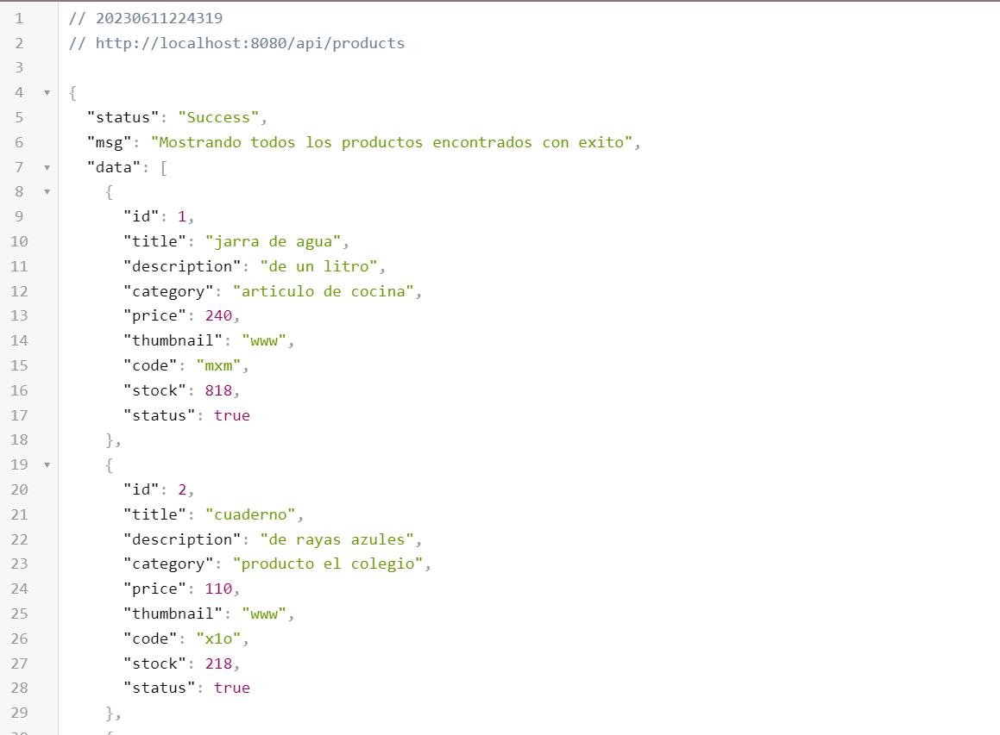
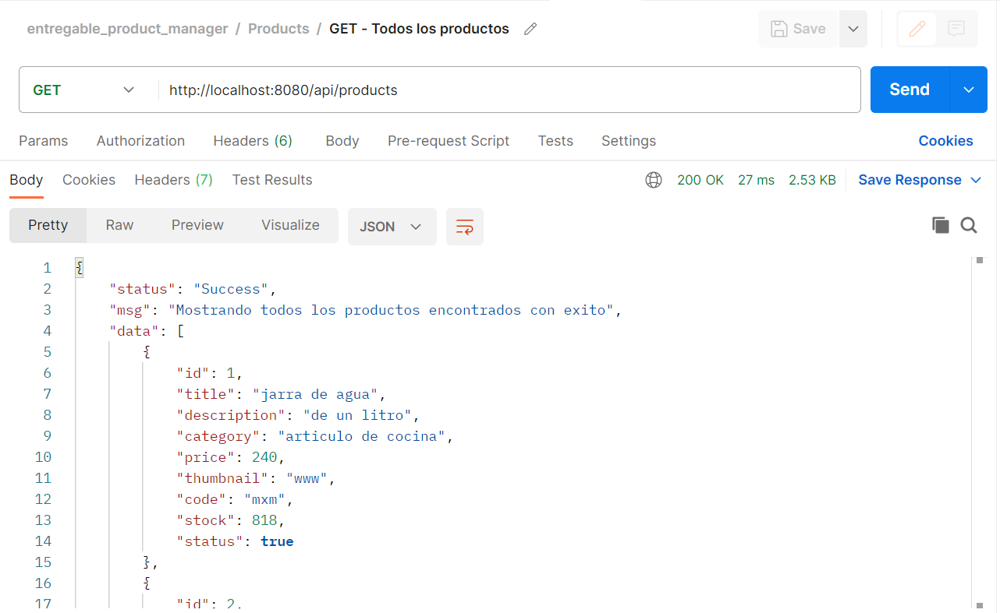

<h1 align="center">
CRUD OF E-COMMERCE
</h1> 

<p align="justify">A backend foundation project for an e-commerce website is presented. Currently, its functionality is tested through API requests in your preferred browser or by using programs like Postman.</p>

<h3>The project offers the following functionalities:</h3>

- Create a product
- View a product
- Update a product
- Delete a product
<br>
- Create a shopping cart
- View a shopping cart
- Update a shopping cart by adding a new product
- Delete a shopping cart


<br><br>
<p align="justify">The entire project is implemented using the native JavaScript module "fs" for file system operations, and JSON files are used for storing information within the server.</p>
<br>

<h4>View from the browser</h4>




<br><br>

<h3>The community and interested individuals are invited to test the following routes using Postman:</h3>

- GET: http://localhost:8080/api/products
- GET: http://localhost:8080/api/products/12
- POST: http://localhost:8080/api/products
- PUT: http://localhost:8080/api/products/2
- DELETE: http://localhost:8080/api/products/18
<br>

- GET: http://localhost:8080/api/carts
- GET: http://localhost:8080/api/carts/4
- POST: http://localhost:8080/api/carts
- POST: http://localhost:8080/api/carts/1/product/11
- DELETE: http://localhost:8080/api/carts/4


<h4>View from Postman</h4>



 <br> <br>

##  Developed with Express
  - <a href="https://www.npmjs.com/package/express">
    
  </a>
  
  <br>

## Technologies used

- JavaScript (100%)

## Keywords

- Back end
- E-commerce
- Create - Read - Update - Delete
- Apis

## Setup

To clone locally and be able to run this application in its entirety, you will need two programs previously installed on your computer. The first one is [Node.js](https://nodejs.org/en/download/) (which comes with [npm](http://npmjs.com) included) and the second one is [Git](https://git-scm.com).
<br>
<br>
Once these prerequisites are resolved, the following is a step-by-step explanation of how to perform the cloning process properly:

```bash
# Clone this repository
$ git clone https://github.com/Alesanzz/crud_apis_backend.git

# Go into the repository
$ cd crud_apis_backend

# Install all the dependencies
$ npm install

# Run the proyect
$ npm start

# Go to the browser and write
$ http://localhost:8080/apis/products
$ http://localhost:8080/apis/carts
```

> **Important**
> If you are using Linux Bash for Windows, we recommend you refer to the following [guide](https://www.howtogeek.com/261575/how-to-run-graphical-linux-desktop-applications-from-windows-10s-bash-shell/).


<br><br>

--- 
## Author

GitHub [@Alesanzz](https://github.com/Alesanzz)  

## License

MIT